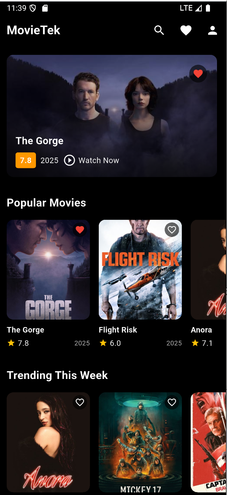
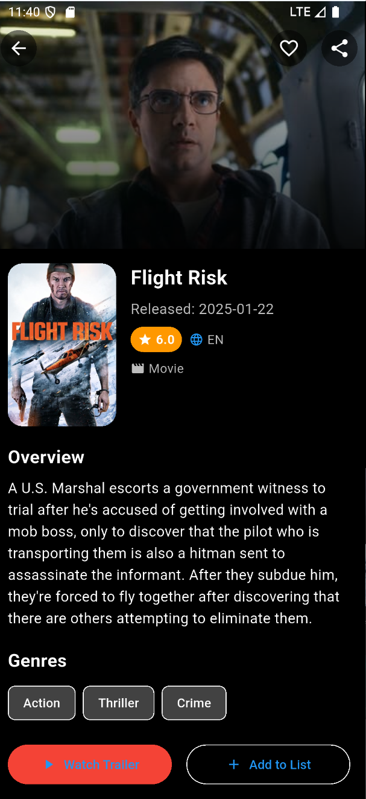
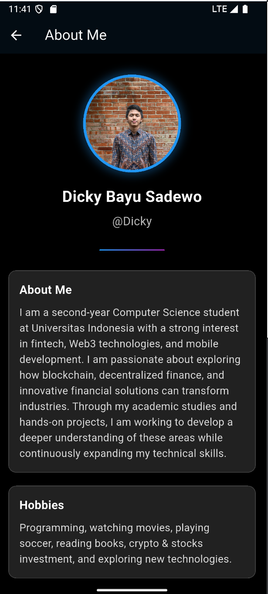

# MovieTek

A movie exploration app developed using Flutter and TMDB API for RISTEK Fasilkom UI 2025 Mobile Development SIG Open Recruitment Assignment.

## Features

- Browse popular and trending movies
- Search for movies by title
- View detailed information about each movie
- Add movies to favorites
- Dark sleek interface
- Responsive design for various screen sizes
- Persistent data storage using SharedPreferences

## Packages Used

- **http**: For API requests to TMDB
- **flutter_dotenv**: To securely store API key
- **shared_preferences**: For local data persistence 
- **provider**: For state management
- **url_launcher**: For opening social media links
- **cached_network_image**: For efficient image loading and caching

## Project Structure

```
lib/
├── main.dart               # App entry point
├── models/
│   └── movie.dart          # Movie data model
├── providers/
│   └── favorites_provider.dart  # Favorites state management
├── screens/
│   ├── about_me_screen.dart     # About me page
│   ├── favorites_screen.dart    # Saved favorites page
│   ├── home_screen.dart         # Main screen with movie listings
│   └── movie_detail_screen.dart # Detailed movie information
└── services/
    └── api_service.dart     # TMDB API communication
```

## Setup Instructions

1. Clone this repository
2. Create a `.env` file in the `assets` folder with:
   ```
   TMDB_API_KEY=your_api_key_here
   ```
3. Get your API key from [The Movie Database](https://www.themoviedb.org/settings/api)
4. Run `flutter pub get` to install dependencies
5. Run the app with `flutter run`

## Lessons Learned

During the development of this movie app, I gained valuable experience in several key areas of mobile development:

Working with the TMDB API taught me how to effectively handle API requests, parse JSON responses, and manage errors gracefully. I learned how to structure network calls to maintain clean and organized code.

Implementing data persistence was particularly challenging but rewarding. I used SharedPreferences and Provider to create a system that saved user favorites, even when the app is closed. This taught me about app state management and the importance of separating the data layer from the UI.

Building a responsive UI was another focus area. I designed the app to look good on various screen sizes, using Flutter's flexible layout system. Creating custom widgets for movie cards, headers, and details screens helped me understand component reusability and the importance of consistent design language.

I also learned about Flutter's navigation system when implementing multiple screens and passing data between them. This included handling back navigation, screen transitions, and maintaining state across different parts of the app.

Finally, error handling was a critical aspect I paid attention to, ensuring the app remains stable even when network requests fail or unexpected data is received. This improved the overall reliability and user experience of the application.

Overall, this project significantly enhanced my Flutter development skills and gave me practical experience in building a complete, feature-rich mobile application.

## Future Improvements

- Add movie trailers using YouTube API
- Implement more advanced filtering and sorting options
- Add user ratings and reviews

## Screenshots

### Home Screen  


### Movie Details Screen  


### About Me Screen  


## Credits

- Movie data provided by [The Movie Database (TMDB)](https://www.themoviedb.org/)
- Assignment by RISTEK Fasilkom UI Mobile Development SIG
